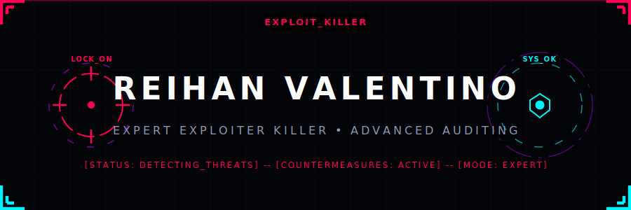

# Hi there, I'm Reihan Valentino Yudistira 👋 (aka @rekalnx)

  

 

  
  
  
  
  

---

### 🛡️ About Me

I am a **Cybersecurity Researcher**, **Bug Bounty Hunter**, and **Smart Contract Auditor** based in Bogor, Indonesia. I specialize in identifying critical vulnerabilities in web applications, APIs, and Solidity-based smart contracts, helping organizations secure their digital infrastructure.

- 🔭 **Current Focus**: Web3 security, Solidity auditing, and advanced threat hunting.
- 🌐 **Personal Website**: [valentinoserv.my.id](https://valentinoserv.my.id)
- 🚀 **NASA VDP Recognition**: Proudly received a **Letter of Recommendation (LoR)** from the **NASA Vulnerability Disclosure Program** for reporting security vulnerabilities.
- 🥇 **Robotics Background**: Represented my school (SMK Plus Pelita Nusantara) in the **National TIK and Informatics Olympiad (OTN) 2024** (Robotik Rancang Bangun category).
- 💬 **Ask me about**: Bug bounty methodologies, recon automation, and Solidity smart contract vulnerabilities.

---

### 🏆 Hackathon & Bug Bounty Highlights

#### 🏦 **HackerOne Profile (`reivalentino`)**
- **Reputation**: `305`
- **Signal**: `4.82` (45th Percentile)
- **Impact**: `28.33` (Top **92nd Percentile** globally!)
- **Total Earnings on Bilt Technologies**: **$11,000+** in bounties, with multiple Critical and High severity reports resolved.

#### 🐛 **HackenProof Profile (`valentinoreihan`)**
- **Rank**: `#1430` globally
- **Reputation**: `179+`
- **Contributions**: Active in 33+ security programs, including the Solv Smart Contracts audit.

---

### 🚀 Technical Skills & Vulnerability Experience

<table>
  <tr>
    <td valign="top" width="50%">
      <h4>🛡️ Cybersecurity & Auditing</h4>
      <ul>
        <li><b>Smart Contract Security</b>: Solidity auditing, DeFi protocols</li>
        <li><b>Web & API Penetration Testing</b>: OWASP Top 10, Auth Bypasses</li>
        <li><b>Reconnaissance</b>: Subfinder, Findomain, Nuclei automation</li>
        <li><b>Key Strengths</b>: CWE-306 (Missing Auth), CWE-598 (Sensitive GET Requests), CWE-200 (Info Disclosure)</li>
      </ul>
    </td>
    <td valign="top" width="50%">
      <h4>💻 Languages & Tooling</h4>
      <ul>
        <li><b>Languages</b>: Solidity, Python, JavaScript, Bash, C/C++ (Arduino/IoT)</li>
        <li><b>Security Tools</b>: Burp Suite, Nuclei, Nmap, Metasploit, Subfinder</li>
        <li><b>Infrastructure</b>: Linux, Zsh, Docker, Git</li>
      </ul>
    </td>
  </tr>
</table>

---

### 📊 GitHub & Hack Stats

 

  
  

 

  

 

  

