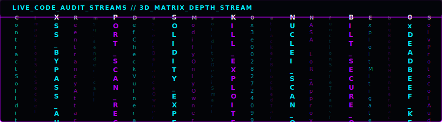
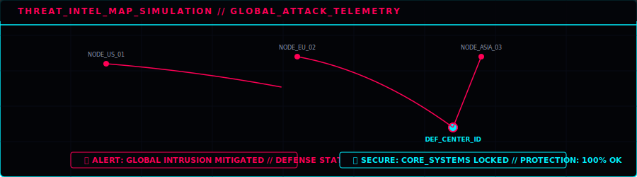
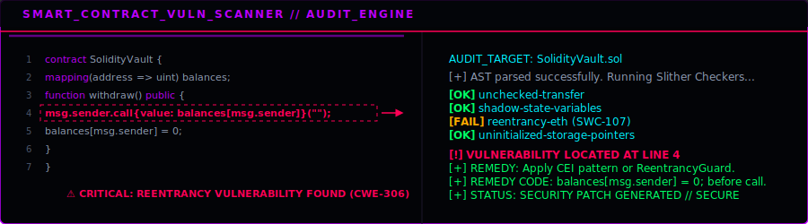
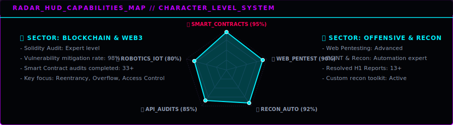

# Hi there, I'm Reihan Valentino Yudistira 👋 (aka @rekalnx)

  

 

  
  
  
  
  

---

### 🛡️ About Me

  

---

### 🖥️ Live Hacking Terminal Simulation & Threat Monitoring

  

| Live Code Streams | Threat Map Simulation |
| :---: | :---: |
|  |  |

---

### 🔍 Security Auditing Core & Telemetry

| Smart Contract Scanner HUD | Telemetry HUD |
| :---: | :---: |
|  |  |

---

### 🏆 Hackathon & Bug Bounty Highlights

#### 🏦 **HackerOne Profile (`reivalentino`)**
- **Reputation**: `305`
- **Signal**: `4.82` (45th Percentile)
- **Impact**: `28.33` (Top **92nd Percentile** globally!)

#### 🐛 **HackenProof Profile (`valentinoreihan`)**
- **Rank**: `#1430` globally
- **Reputation**: `179+`
- **Contributions**: Active in 33+ security programs, including the Solv Smart Contracts audit.

---

### 🚀 Technical Skills

  

---

### 📊 Capabilities Map & GitHub Stats

| Capabilities Map | GitHub Stats |
| :---: | :---: |
|  |  |

 

  
  

 

  

